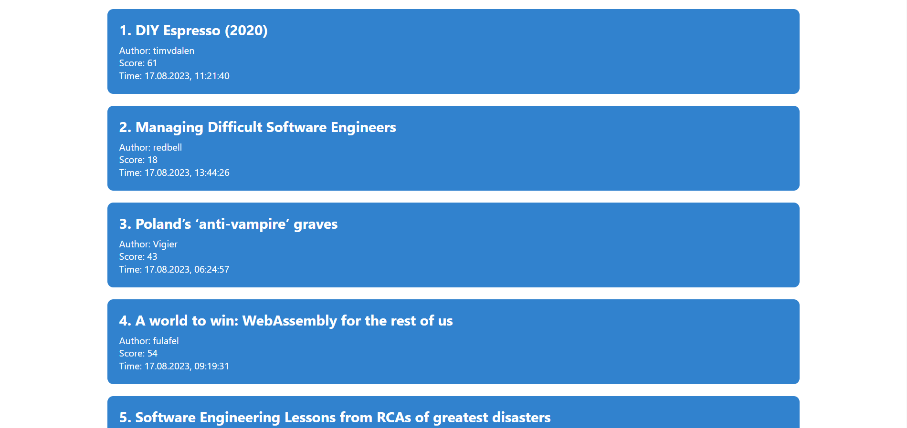

# Hacker news

**Вы также можете прочитать этот README на [русском](https://github.com/klekwedge/hacker-news/blob/main/README.md)**

## Table of contents

- [Deployment instructions](#deployment-instructions)
- [Overview](#overview)
  - [Screenshot](#screenshot)
  - [Links](#links)
- [My process](#my-process)
  - [Built with](#built-with)
  - [What I learned](#what-i-learned)
- [Author](#author)

## Deployment instructions

**To run the project, you need to have [npm](https://nodejs.org/en/) and [git](https://git-scm.com/downloads) installed on your computer**

1. Make a clone of this repository ```git clone https://github.com/klekwedge/hacker-news.git```
2. Install all required npm packages with ```npm i```
3. Run the project with the command ```npm run dev```

## Overview

Develop an interface for the [Hacker News](https://news.ycombinator.com/news) website, consisting of two pages.

### Main page
- Shows the latest 100 news as a list sorted by date, most recent on top.
- Each news contains:
- Name
- rating
  - author's nickname
  - publication date
  - By clicking on the news, you go to the news page
- The list of news should be automatically updated once a minute without user intervention
- The page should have a button to force the update of the news list

### News page
- Must contain:
   - link to news
   - news title
   - date
   - author
   - counter of the number of comments
   - list of comments in the form of a tree
- Root comments are loaded immediately upon entering the page, nested - by clicking on the root.
- There should be a button on the page to force refresh the list of comments
- The page should have a button to return to the list of news

### Technical requirements
- App developed using React and MobX
- Used [official Hacker News API](https://github.com/HackerNews/API). Hacker News API calls and data processing are made directly from the front-end (except if you do an optional task about Node.JS).
- Routing done using [React Router v5](https://github.com/ReactTraining/react-router/releases/tag/v5.0.0)
- Any UI framework of your choice (as an example [Ant Design](https://ant.design/) or [Semantic UI](https://react.semantic-ui.com/)).
     - You can also use pure css, the main thing is to be beautiful
- `yarn` package manager
- The application must be launched at `localhost:3000` with `yarn start`
- When clicking on links, the page does not reload
- The source code of the solution must be posted from your account on [Github](http://github.com/)

### Optional tasks
- Using TypeScript
- Backend for hosting statics and API for encapsulating external requests in Node.JS
- Code coverage with unit tests

### Screenshot



### Links

- [Solution URL](https://github.com/klekwedge/hacker-news)
- [Live Site URL](https://klekwedge-hacker-news.vercel.app/)

## My process

### Built with

- React
- TypeScript
- Redux Toolkit
- SCSS
- Chakra UI

### What I learned

## Author

- [Website](https://klekwedge-cv.vercel.app/)
- [Linkedin](https://www.linkedin.com/in/klekwedge/)
- [Facebook](https://www.facebook.com/klekwedge)

