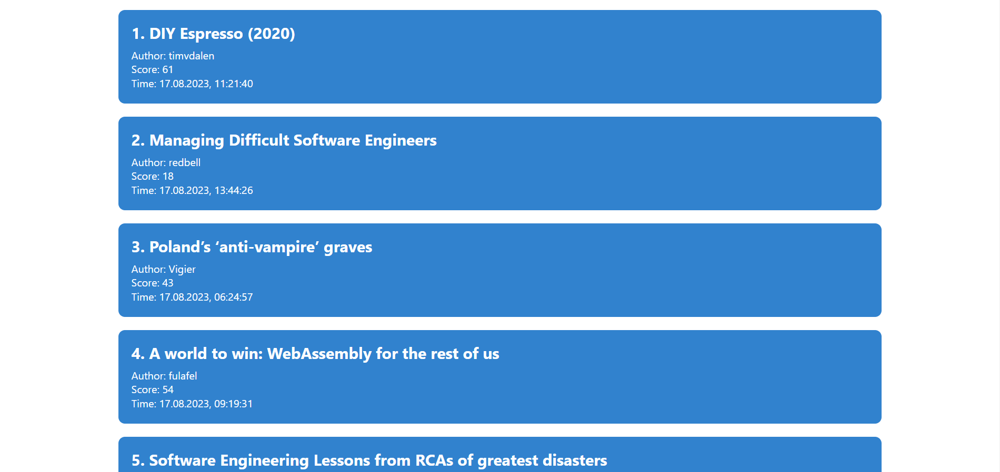

# Hacker news

**You can also read this README in [English](https://github.com/klekwedge/hacker-news/blob/main/README.EN.md).**

## Оглавление

- [Инструкции по развертыванию](#инструкции-по-развертыванию)
- [Обзор](#обзор)
  - [Скриншот](#скриншот)
  - [Ссылки](#ссылки)
- [Мой процесс](#мой-процесс)
  - [Стек](#стек)
  - [Что я узнал](#что-я-узнал)
- [Автор](#автор)

## Инструкции по развертыванию

**Для запуска проекта на вашем компьютере должны быть установлены [npm](https://nodejs.org/en/) и [git](https://git-scm.com/downloads)**

1. Сделайте клон этого репозитория ```git clone https://github.com/klekwedge/hacker-news.git```
2. Установите все необходимые пакеты npm с помощью ```npm i```
3. Запустите проект командой ```npm run dev```

## Обзор

Разработать интерфейс для сайта [Hacker News](https://news.ycombinator.com/news), состоящий из двух страниц.

### Главная страница
- Показывает последние 100 новостей в виде списка, отсортированного по дате, самые свежие сверху.
- Каждая новость содержит:
	- название
	- рейтинг
 - ник автора
 - дату публикации
 - По клику на новость происходит переход на страницу новости
- Список новостей должен автоматически обновляться раз в минуту без участия пользователя
- На странице должна быть кнопка для принудительного обновления списка новостей

### Страница новости
- Должна содержать:
  - ссылку на новость
  - заголовок новости
  - дату
  - автора
  - счётчик количества комментариев
  - список комментариев в виде дерева
- Корневые комментарии подгружаются сразу же при входе на страницу, вложенные - по клику на корневой.
- На странице должна быть кнопка для принудительного обновления списка комментариев
- На странице должна быть кнопка для возврата к списку новостей

### Технические требования
- Приложение разработано с использованием React и MobX
- Использован [официальный API Hacker News](https://github.com/HackerNews/API). Вызовы Hacker News API и обработка данных от него производятся напрямую с фронтенда (кроме случая, если вы сделаете опциональное задание про Node.JS).
- Роутинг выполнен с использованием [React Router v5](https://github.com/ReactTraining/react-router/releases/tag/v5.0.0)
- Фреймворк UI любой на ваше усмотрение (как пример [Ant Design](https://ant.design/) или [Semantic UI](https://react.semantic-ui.com/)).
    - Можно и на чистом css, главное, чтобы было красиво
- Пакетный менеджер `yarn`
- Приложение должно запускаться по адресу `localhost:3000` командой `yarn start`
- При переходах по ссылкам страница не перезагружается
- Исходный код решения должен быть выложен с вашего аккаунта на [Github](http://github.com/)

### Опциональные задания
- Использование TypeScript
- Бэкенд для хостинга статики и API для инкапсуляции внешних запросов на Node.JS
- Покрытие кода юнит-тестами

### Скриншот



### Ссылки

- [Ссылка на проект](https://github.com/klekwedge/hacker-news)
- [Деплой](https://klekwedge-hacker-news.vercel.app/)

## Мой процесс

### Стек

- React
- TypeScript
- Redux Toolkit
- SCSS
- Chakra UI

## Автор

- [Вебсайт](https://klekwedge-cv.vercel.app/)
- [Linkedin](https://www.linkedin.com/in/klekwedge/)
- [Facebook](https://www.facebook.com/klekwedge)
